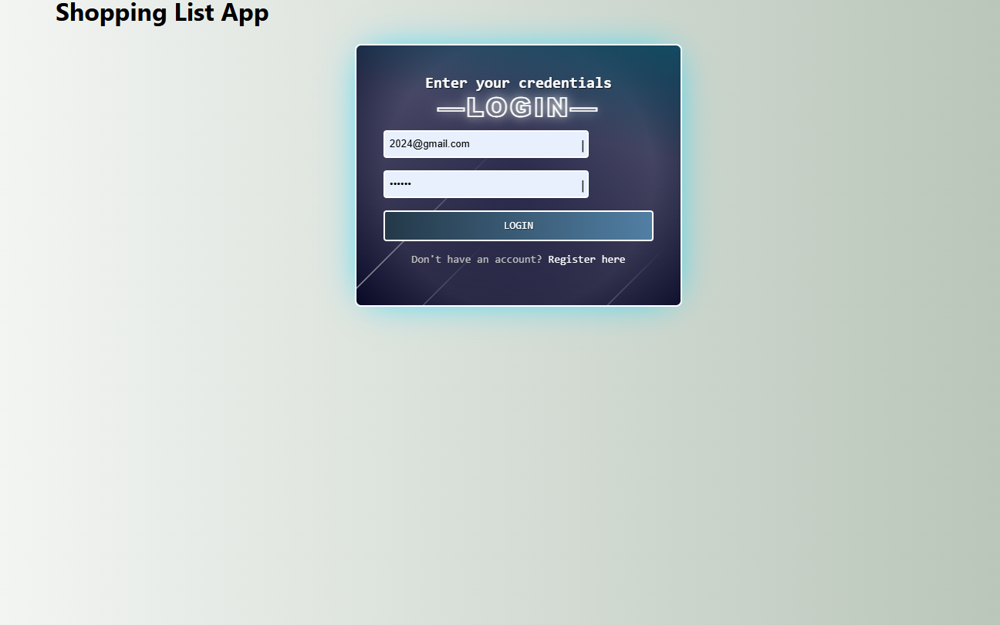
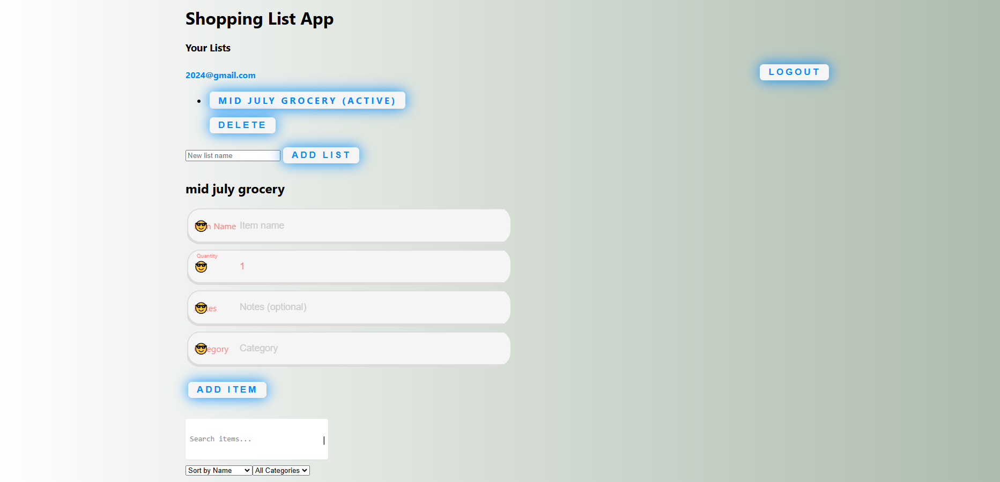

## Shopping List App
A shopping list application built with React and Redux, featuring a comprehensive set of functionalities for list management, search, sorting, and user authentication, along with offline support.

## Features
1. Redux for State Management
Utilizes Redux to efficiently manage application state across components, ensuring a consistent user experience.
2. CRUD Functionality
Create: Users can add new items to the shopping list.
Read: Displays a list of current items.
Update: Allows users to edit item details such as name, quantity, and notes.
Delete: Users can remove items they no longer need.
3. List Management
Shopping items are displayed with all essential details for easy list management, including name, quantity, and optional notes.
4. Item Categories & Tags
Users can categorize items or add tags to better organize their lists.
5. Search Functionality
Implements a search bar to quickly find items within lists.
6. Sorting and Filtering
Users can sort and filter items based on criteria like name and category for easy browsing.
7. Multiple Shopping Lists
Supports multiple lists (e.g., groceries, household items) to cater to different shopping needs.
8. Sharing Lists
Users can share shopping lists with others, facilitating collaborative shopping experiences.
9. Offline Support
Provides offline functionality, allowing users to continue managing lists without an internet connection. Synchronizes data automatically when reconnected.
10. Data Storage with JSON-Server
Integrates with JSON-Server to store shopping list data securely, enabling reliable data storage and retrieval.
11. User Authentication
Secures the application with user authentication, ensuring that only authorized users can access their shopping lists.
12. User Interface
Designed with a user-friendly interface that offers intuitive controls for adding, editing, and deleting items.
13. Privacy & Security
Implements measures to protect user data and privacy, in compliance with relevant privacy laws and regulations.

## Tech Stack
Frontend: React.js for a dynamic and responsive user interface.
State Management: Redux for robust state handling across components.
Backend: JSON-Server to store shopping list data.
Authentication: Firebase Authentication (or similar service).
Offline Support: PWA (Progressive Web App) features for offline functionality.
Installation & Setup
Clone the repository:

## bash
Copy code
git clone https://github.com/yourusername/shopping-list-app.git
cd shopping-list-app
Install dependencies:

## bash
Copy code
npm install
Run JSON-Server:

## bash
Copy code
json-server --watch db.json --port 3001
Run the Application:

## bash
Copy code
npm start
The application will be available at http://localhost:3000.

## SCREENSHOT

### Home Screen 

*Login shopping app*

### Home Screen 

*shopping app*